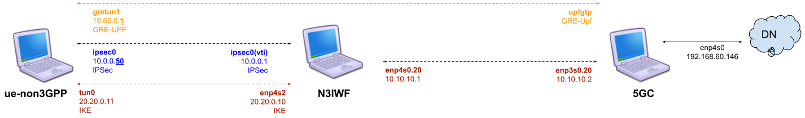
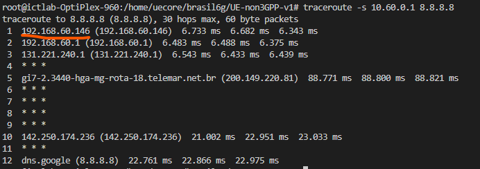

# Proto6G-Install
This repository describes steps for installing the elements that make up Proto6G (UE-non3GPP + N3IWF + Free5gc). The installation process involves 3 different machines 1st responsible for running 5GC, 2nd responsible for running N3IWF and 3rd responsible for running UE-non3GPP

#### 5GC environment
* SO: Ubuntu 20.04 (LTS) x64
* Uname -r: >= 5.4.0-122-generic
* Memory: 4 GB
* Disk: 80 GB

#### N3IWF environment
* SO: Ubuntu 20.04 (LTS) x64
* Memory: 2 GB
* Disk: 20 GB

#### UE-non3GPP environment
* SO: Ubuntu 20.04 (LTS) x64
* Memory: 2 GB
* Disk: 20 GB

The steps described in this repository were performed based on a network topology similar to the one shown in the figure below:
<p align="center">
     
</p>


## Proto6G components installation
The installation steps for each of the 3 components are described below. 
**Attention: All installation steps described below must be performed with root privileges (SUDO SU).**

#### 1º 5GC (Free5gc)
Access via terminal the machine where the 5GC will be executed. 
Install python + git + ansible:
```
sudo apt update && apt -y install python && sudo apt -y install git && sudo apt -y install ansible
```

Clone this repository:
```
git clone https://github.com/LABORA-INF-UFG/Proto6G-Install.git
```

Install GOLang 1.14.4:
```
cd Proto6G-Install &&  ansible-playbook -K golang-install.yml
source ~/.bashrc
```

Run ```ifconfig``` and get the name of **internet network interface**, that provides to the host with access to the internet, like as illustrated in the figure below:
<p align="center">
     
</p>
This interface that will be used by the UPF to provide internet access to the UE's registered in the 5GC.

Run the following Ansible playbook (password for sudo is required):
```
cd Proto6G-Install && ansible-playbook -K 5gc-install.yml -e  "internet_network_interface=<< internet network interface name>>"
```

Wait a few seconds for Ansible to finish configuring the 5GC. The result of the execution should look something like the one shown in the figure below.
<p align="center">
     
</p>

#### Initializing the 5GC functions
After installation we must initialize the 5GC. The entire installation was performed following the standard for applications written in GOLang. Go to `` /root/go/src/free5gc `` and run the following command to init 5GC functions ``./run.sh ``. After execution, the expected result is something similar to what is shown in the following figure.
<p align="center">
     
</p>

**Important Note:** In the image above, the __verbosity level__ of the UPF LOG was defined as ``TRACE``. In a standard installation, the __verbosity level__ is probably defined as ``INFO``, so the output will probably not be identical to the image above, which does not mean an 5GC initialization failure. Pay attention to any messages labeled as ``ERROR`` in the log output, they will be printed in <span style='color:red;'>red collor</span> and then they will indicate some failure in the installation process.

<span style="color:red;">
red collor
</span>

#### Initializing the 5GC API Server
After initializing the microservices that control the data and control planes, it is also necessary to initialize the API that controls access to the 5GC database in MongoDB. This service will be used later for the registration of UEs in the 5GC.  Open another terminal and access the  `` /root/go/src/free5gc/webconsole `` directory. Then type the following command  `` go run server.go ``. . After execution, the expected result is something similar to what is shown in the following figure.
<p align="center">
     
</p>

#### 2º N3IWF (Free5gc)
Access via terminal the machine where the N3IWF will be executed. 
Install python + git + ansible:
```
sudo apt update && apt -y install python && sudo apt -y install git && sudo apt -y install ansible
```

Clone this repository:
```
git clone https://github.com/LABORA-INF-UFG/Proto6G-Install.git
```

Install GOLang 1.14.4:
```
cd Proto6G-Install &&  ansible-playbook -K golang-install.yml
source ~/.bashrc
```

Run the following Ansible playbook to install N3IWF (password for sudo is required):
```
cd Proto6G-Install && ansible-playbook -K n3iwf-install.yml
```

##### Start N3IWF
After installing the N3IWF and with the 5GC properly initialized (see instructions [here](https://github.com/LABORA-INF-UFG/Proto6G-Install#initializing-the-5gc-functions)), access the  `` /root/go/src/free5gc/NFs/n3iwf `` directory. Then type the following command  `` go run cmd/main.go `` . After execution, the expected result is something similar to what is shown in the following figure.
<p align="center">
     
</p>

#### 3º UE-non3GPP
Access via terminal the machine where the UE-non3GPP will be executed. 
Install python + git + ansible:
```
sudo apt update && apt -y install python && sudo apt -y install git && sudo apt -y install ansible
```

Clone this repository:
```
git clone https://github.com/LABORA-INF-UFG/Proto6G-Install.git
```

Install GOLang 1.14.4:
```
cd Proto6G-Install &&  ansible-playbook -K golang-install.yml
source ~/.bashrc
```

Run the following Ansible playbook to install N3IWF (password for sudo is required):
```
cd Proto6G-Install && ansible-playbook -K ue-non3gpp-install.yml
```
Wait a few seconds for Ansible to finish configuring the UE-non3GPP. The result of the execution should look something like the one shown in the figure below.
<p align="center">
     
</p>

##### Register UE-non3GPP into 5GC
After installing UE-non3GPP and with the 5GC API properly initialized (see instructions [here](https://github.com/LABORA-INF-UFG/Proto6G-Install#initializing-the-5gc-api-server)), access the ``/root/go/src/UE-non3GPP/assets`` dir. Then open the ``include_ue.sh`` file in a text editor (VI or Nano) and replace ``<<replace-this-for-5GCoreAPI-Ip-Address>>`` with the IP address of the machine where the 5GC is running.
<p align="center">
     
</p>

Attention, if the machine where the UE-non3GPP is being configured does not have access to the machine where the 5GC is, the ``include_ue.sh`` file can be moved to another machine to be executed. The purpose of the ``include_ue.sh`` is to register the UE in the 5GC's MongoDB database, avoiding the need for registration through the Free5GC Web User Interface. May need to assign permission to run ``include_ue.sh`` file (``chmod 777 -R include_ue.sh``). After executing ``include_ue.sh``, a log message will be presented in the [terminal where the 5GC API is being executed](https://github.com/LABORA-INF-UFG/Proto6G-Install#initializing-the-5gc-api-server). The expected result is something similar to the one shown in the figure below (unconsidered the error message).
<p align="center">
     
</p>

## Testing Proto6G components
After performing the [installation](https://github.com/LABORA-INF-UFG/Proto6G-Install#steps-installation) of the Proto6G components, we will test if the components were configured correctly. Open new terminal on the machine where UE-non3GPP was installed, go to the ``/root/go/src/UE-non3GPP `` dir and run the following command ``go run cmd/main.go ue``. After executing the command, the expected result is something similar to the one shown in the following figure.
<p align="center">
     
</p>

On the same machine, open another terminal and type ``ifconfig``. This command will list all available network interfaces. You should check if there are two network interfaces that were created by running UE-non3GPP on the list, they are: ``ipsec0`` and ``gretun1``, as highlighted by the red line in the image below.
<p align="center">
     
</p>

In the figure above, observe the IP address highlighted by the yellow line. This address was provided by the UPF, and it is through it that UE-non3GPP will gain access to the data network. To test the connection through the 5GC, just run a **PING** command specifying the gretun1 network interface:

```
ping -I gretun1 8.8.8.8
```
The expected result is something similar to the one shown in the following figure.
<p align="center">
     
</p>

The above log output indicates internet access through the network interface generated by UE-non3GPP. With the command `` traceroute -s 10.60.0.X 8.8.8.8 `` applied to the **gretun1** interface, we will see that the traffic on the interface generated by UE-non3GPP has as its output route (1st hop IP address) the IP address of the network interface that gives access to the internet on the machine where it is being run the 5GC, as shown in the image below. 
<p align="center">
     
</p>
That is, data traffic is flowing through the N3IWF, being managed and provided by the 5GC.

## Troubleshooting
Because it is a complex environment involving several components with different responsibilities and which must work in an integrated manner, some problems may arise during execution. Possible problems and their respective solutions are listed below.

### N3IWF
#### XFRM rules in N3IWF interface
Eventually, the machine responsible for running the N3IWF can throw errors related to the xfrm interface. It is a set of kernel modules and userspace tools that allow configuration and management of IPsec policies and transformations. When a problem related to the xfrm interface occurs, the log reported in N3IEF will be equivalent to the one shown in the following image.
<p align="center">
     
</p>

Solution:

* Terminate the N3IWF execution
* run xfrm state flush: ``ip xfrm state flush``
* run xfrm policy flush: ``ip xfrm policy flush``
* [Restart the N3IWF](https://github.com/LABORA-INF-UFG/Proto6G-Install#start-n3iwf)

### UE-non3GPP
#### Conflict on the GRETUN and IPSEC Interfaces
When running UE-non3GPP two network interfaces are created (**gretun** and **ipsec**). When terminating UE-non3GPP, in theory these interfaces should be removed, however in some cases they remain active. In these situations, it is necessary to remove the interfaces created so as not to generate a network conflict in the case of a new execution of the UE-non3GPP code on the machine. To remove the interfaces, just run the commands below:
```
sudo ip link del ipsec0
sudo ip link del gretun1
```

### 5GC
#### Conflict in the execution of network functions
The 5GC network functions are initialized through a `` ./run.sh ``. If, eventually, the connection with the terminal that initialized the .sh is closed improperly, the functions will continue running as loose processes on the execution stack. When trying to initialize the 5GC again, errors related to connection ports that are already in use will be triggered.
To solve the problem, just run `` ./force_kill.sh ``, is located in the same directory as the ``run.sh`` script. When executing  `` ./force_kill.sh `` all active processes related to the execution of the 5GC functions will be terminated and a new execution can be performed.

#### Conflict in the execution of 5GC API server
For a UE to be able to use the 5GC functionalities, it must be duly registered in the database. This record is performed through a [Rest API](https://github.com/LABORA-INF-UFG/Proto6G-Install#initializing-the-5gc-api-server) provided by the 5GC.
If eventually the terminal used to initialize the API is closed improperly, port 5000 will remain in use, preventing a new execution. In this case, the process must be terminated using kill -9 as described below:
* Find the PID of the process that is using port 50000: ``sudo netstat -nlp | grep :5000``
* Kill the process through the PID:: ``kill -9 <<PID-Nº>>``

#### Data inconsistency in 5GC MongoDB
In experimental scenarios, where the UE-non3GPP + 5GC connection procedures are repeated several times, it may happen that MongoDB persists inconsistent information. In these cases, it is interesting to delete the database and register the UEs again. To resolve the issue, perform the following steps:
* Terminate the execution of UE-non3GPP, N3IWF and 5GC.
* Access through a new terminal on the machine where 5GC was installed.
* Type in terminal `` mongo ``  to connect MongoDB CLI.
* In MongoDB CLI type `` use free5gc `` to connect to free5gc base.
* Type `` db.dropDatabase() `` to completely delete the 5gc database.

After deleting the database, [initialize 5GC](https://github.com/LABORA-INF-UFG/Proto6G-Install#initializing-the-5gc-functions), [initialize API Server](https://github.com/LABORA-INF-UFG/Proto6G-Install#initializing-the-5gc-api-server), [initialize N3IWF](https://github.com/LABORA-INF-UFG/Proto6G-Install#start-n3iwf), [register UE-non3GPP](https://github.com/LABORA-INF-UFG/Proto6G-Install#register-ue-non3gpp-into-5gc) and [test Proto6G components](https://github.com/LABORA-INF-UFG/Proto6G-Install#testing-proto6g-components).
