# Proto6G-Install
This repository describes steps for installing the elements that make up Proto6G (UE-non3GPP + N3IWF + Free5gc). The installation process involves 3 different machines 1st responsible for running 5GC, 2nd responsible for running N3IWF and 3rd responsible for running UE-non3GPP

#### 5GC environment
* SO: Ubuntu 20.04 (LTS) x64
* Uname -r: >= 5.4.0-122-generic
* Memory: 4 GB
* Disk: 80 GB

#### N3IWF environment
* SO: Ubuntu 20.04 (LTS) x64
* Memory: 2 GB
* Disk: 20 GB

#### UE-non3GPP environment
* SO: Ubuntu 20.04 (LTS) x64
* Memory: 2 GB
* Disk: 20 GB

## Proto6G components installation
The installation steps for each of the 3 components are described below.

#### 1º 5GC (Free5gc)
Access via terminal the machine where the 5GC will be executed. 
Install python + git + ansible:
```
sudo apt update && apt -y install python && sudo apt -y install git && sudo apt -y install ansible
```

Clone this repository:
```
git clone https://github.com/LABORA-INF-UFG/Proto6G-Install.git
```

Install GOLang 1.14.4:
```
cd Proto6G-Install &&  ansible-playbook -K install-golang.yml
source ~/.bashrc
```

Run ```ifconfig``` and get the name of **internet network interface**, that provides to the host with access to the internet, like as illustrated in the figure below:
<p align="center">
     
</p>
This interface that will be used by the UPF to provide internet access to the UE's registered in the 5GC.

Run the following Ansible playbook (password for sudo is required):
```
cd Proto6G-Install && ansible-playbook -K 5gc-install.yml -e  "internet_network_interface=<< internet network interface name>>"
```

Wait a few seconds for Ansible to finish configuring the 5GC. The result of the execution should look something like the one shown in the figure below.
<p align="center">
    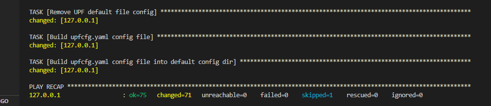 
</p>

#### Initializing the 5GC functions
After installation we must initialize the 5GC. The entire installation was performed following the standard for applications written in GOLang. Go to `` /root/go/src/free5gc `` and run the following command to init 5GC functions ``./run.sh ``. After execution, the expected result is something similar to what is shown in the following figure.
<p align="center">
    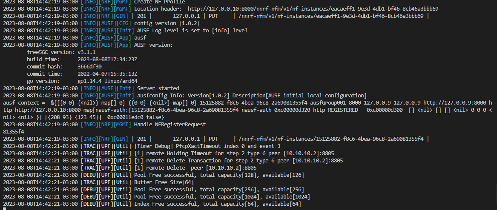 
</p>

#### Initializing the 5GC API Server
After initializing the microservices that control the data and control planes, it is also necessary to initialize the API that controls access to the 5GC database in MongoDB. This service will be used later for the registration of UEs in the 5GC.  Open another terminal and access the  `` /root/go/src/free5gc/webconsole `` directory. Then type the following command  `` go run server.go ``. . After execution, the expected result is something similar to what is shown in the following figure.
<p align="center">
    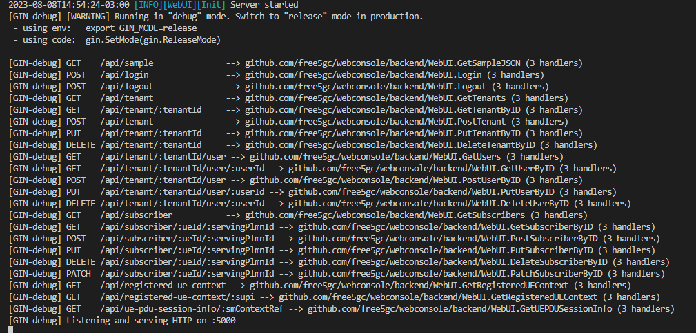 
</p>

#### 2º N3IWF (Free5gc)
Access via terminal the machine where the N3IWF will be executed. 
Install python + git + ansible:
```
sudo apt update && apt -y install python && sudo apt -y install git && sudo apt -y install ansible
```

Clone this repository:
```
git clone https://github.com/LABORA-INF-UFG/Proto6G-Install.git
```

Install GOLang 1.14.4:
```
cd Proto6G-Install &&  ansible-playbook -K install-golang.yml
source ~/.bashrc
```

Run the following Ansible playbook to install N3IWF (password for sudo is required):
```
cd Proto6G-Install && ansible-playbook -K n3iwf-install.yml
```
After installing the N3IWF and with the 5GC properly initialized (see instructions [here](https://github.com/LABORA-INF-UFG/Proto6G-Install#initializing-the-5gc-functions)), access the  `` /root/go/src/free5gc/NFs/n3iwf `` directory. Then type the following command  `` go run cmd/main.go `` . After execution, the expected result is something similar to what is shown in the following figure.
<p align="center">
    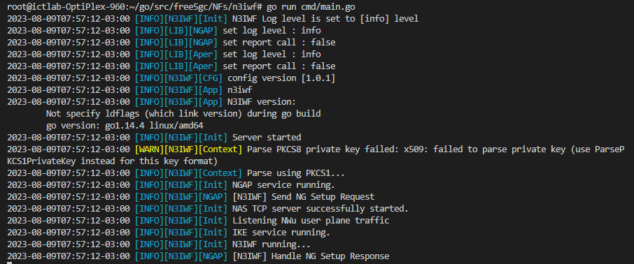 
</p>

#### 3º UE-non3GPP
Access via terminal the machine where the UE-non3GPP will be executed. 
Install python + git + ansible:
```
sudo apt update && apt -y install python && sudo apt -y install git && sudo apt -y install ansible
```

Clone this repository:
```
git clone https://github.com/LABORA-INF-UFG/Proto6G-Install.git
```

Install GOLang 1.14.4:
```
cd Proto6G-Install &&  ansible-playbook -K install-golang.yml
source ~/.bashrc
```

Run the following Ansible playbook to install N3IWF (password for sudo is required):
```
cd Proto6G-Install && ansible-playbook -K ue-non3gpp-install.yml
```
Wait a few seconds for Ansible to finish configuring the UE-non3GPP. The result of the execution should look something like the one shown in the figure below.
<p align="center">
    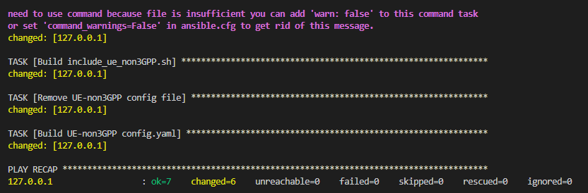 
</p>

After installing UE-non3GPP and with the 5GC API properly initialized (see instructions [here](https://github.com/LABORA-INF-UFG/Proto6G-Install#initializing-the-5gc-api-server)), access the ``/root/go/src/UE-non3GPP/assets`` dir. Then open the ``include_ue.sh`` file in a text editor (VI or Nano) and replace ``<<replace-this-for-5GCoreAPI-Ip-Address>>`` with the IP address of the machine where the 5GC is running.
<p align="center">
    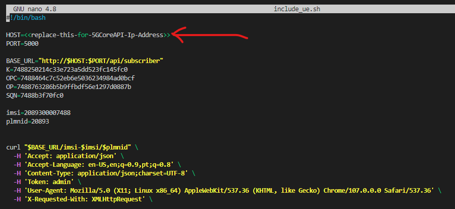 
</p>

Attention, if the machine where the UE-non3GPP is being configured does not have access to the machine where the 5GC is, the ``include_ue.sh`` file can be moved to another machine to be executed. The purpose of the ``include_ue.sh`` is to register the UE in the 5GC's MongoDB database, avoiding the need for registration through the Free5GC Web User Interface. May need to assign permission to run ``include_ue.sh`` file (``chmod 777 -R include_ue.sh``). After executing ``include_ue.sh``, a log message will be presented in the [terminal where the 5GC API is being executed](https://github.com/LABORA-INF-UFG/Proto6G-Install#initializing-the-5gc-api-server). The expected result is something similar to the one shown in the figure below (unconsidered the error message).
<p align="center">
    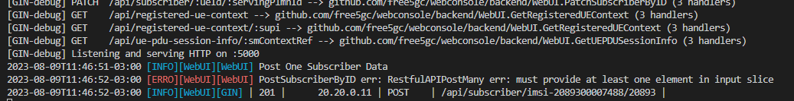 
</p>

## Testing Proto6G components
After performing the [installation](https://github.com/LABORA-INF-UFG/Proto6G-Install#steps-installation) of the Proto6G components, we will test if the components were configured correctly. Open new terminal on the machine where UE-non3GPP was installed, go to the ``/root/go/src/UE-non3GPP `` dir and run the following command ``go run cmd/main.go ue``. After executing the command, the expected result is something similar to the one shown in the following figure.
<p align="center">
    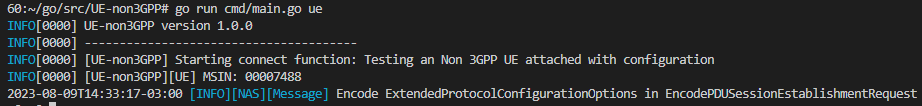 
</p>

On the same machine, open another terminal and type ``ifconfig``. This command will list all available network interfaces. You should check if there are two network interfaces that were created by running UE-non3GPP on the list, they are: ``ipsec0`` and ``gretun1``, as highlighted by the red line in the image below.
<p align="center">
    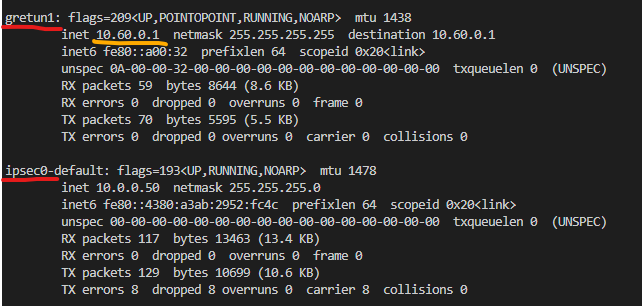 
</p>
In the figure above, observe the IP address highlighted by the yellow line. This address was provided by the UPF, and it is through it that UE-non3GPP will gain access to the data network. To test the connection through the 5GC, just run a **PING** command specifying the gretun1 network interface:

```
ping -I gretun1 8.8.8.8
```
The expected result is something similar to the one shown in the following figure.
<p align="center">
    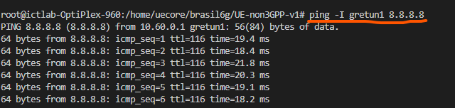 
</p>

## Possíveis Problemas

Eventualmete a N3IWF pode disparar um erro relacionado às interfaces XFRM do Linux. Imagem abaixo
<p align="center">
    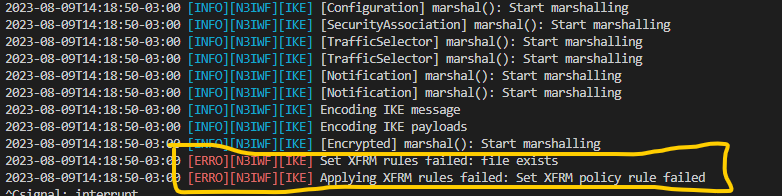 
</p>